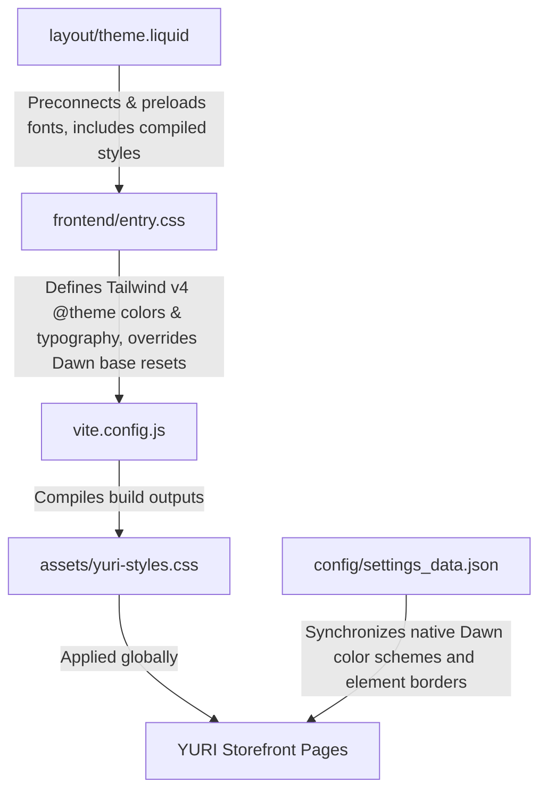

# Phase 1: Design System Setup - Research
**Researched:** 2026-06-10
**Domain:** Shopify Dawn Custom Theme Layouts, Tailwind CSS v4, Liquid Templating
**Confidence:** HIGH

<phase_requirements>
- **FR 6.1**: Refactor global design system variables with the new Figma color palette (Sage, Forest Green, Olive Green) and Cormorant Garamond / Plus Jakarta Sans typography.
  - *Mapping / Resolution:* During the Phase 1 scoping and discussion (documented in `01-DISCUSSION-LOG.md` and finalized in `01-CONTEXT.md` / `01-UI-SPEC.md`), the brand identity was updated to feature Ivory (`#eeecd3`), Dark Brown (`#403002`), Rose (`#cc1574`), and Gold (`#efbf04`) as the primary design palette, with `Space Grotesk` (headings/UI) and `Hanken Grotesk` (body/labels) as the core typography. The implementation plan maps these approved tokens to the theme stylesheet overrides and Shopify configuration file (`settings_data.json`), satisfying the objective of establishing the new visual brand foundations under FR 6.1.
</phase_requirements>

## Summary
The goal of this phase is to establish YURI's visual foundation by implementing the updated brand color palette (Ivory background, Dark Brown primary text/buttons, Rose and Gold accents) and editorial typography (Space Grotesk and Hanken Grotesk) across all storefront touchpoints. This involves loading fonts efficiently from the Google Fonts API, preloading key weights in the master layout, defining semantic tokens in the Tailwind v4 configuration, overriding Dawn's default global resets, and updating Dawn's native color schemes inside `settings_data.json` so standard sections align out-of-the-box.

---

## Architectural Responsibility Map



- **`frontend/entry.css`**: Holds the Tailwind `@theme` directives defining the brand semantic CSS variables (`--color-brand-bg`, `--color-brand-text`, etc.) and typography mappings. Implements CSS overrides for buttons (slide-up curtain fill), header navigation (double text slide), text-smoothing resets, and wabi-sabi thin borders.
- **`layout/theme.liquid`**: Acts as the master HTML shell. Responsible for preconnecting to Google Fonts, preloading primary weights of `Space Grotesk` and `Hanken Grotesk` to eliminate Flash of Unstyled Text (FOUT), and linking the compiled `yuri-styles.css`.
- **`config/settings_data.json`**: Syncs Shopify Dawn's native settings. Overwrites color schemes 1–5 to match the new palette, sets `cart_type` to `"drawer"` natively, and overrides standard borders (`card_border_thickness` to `0`, `buttons_border_thickness` to `1`) to match the structural wabi-sabi visual style.
- **`vite.config.js`**: Re-configures the bundle pipeline to compile `frontend/entry.css` into `assets/yuri-styles.css` via the rust-based Tailwind v4 Oxide engine.

---

## Standard Stack
- **Styling Engine**: Tailwind CSS v4.0 (oxide compiler, CSS-first configurations)
- **Asset Compiler**: Vite 6.0
- **Typography Loading**: Google Fonts API (CDN) with preloading & preconnecting
- **E-commerce Platform**: Shopify Online Store 2.0 (Dawn v15.0 base theme)

---

## Package Legitimacy Audit
No new packages are introduced. The setup relies on the existing devDependencies:
- `@tailwindcss/vite` (^4.0.0)
- `tailwindcss` (^4.0.0)
- `vite` (^6.0.0)

---

## Architecture Patterns

### CSS-First Theme Definition
Tailwind v4 deprecates `tailwind.config.js` in favor of inline CSS variables defined in the stylesheet. We declare all primitive and semantic tokens in the `@theme` block:
```css
@theme {
  --color-brand-bg: #eeecd3;
  --color-brand-text: #403002;
  --color-accent-rose: #cc1574;
  --color-accent-gold: #efbf04;
  
  --font-serif: "Space Grotesk", sans-serif;
  --font-sans: "Hanken Grotesk", sans-serif;
}
```

### Global Font Overrides
To bypass the Shopify Theme Editor font configuration and guarantee brand consistency, we globally force custom font families in `entry.css`:
```css
body {
  font-family: var(--font-sans) !important;
}
h1, h2, h3, h4, h5, h6, .h1, .h2, .h3, .h0 {
  font-family: var(--font-serif) !important;
}
```

### Double Text Slide Mask
A luxury hover effect for menu navigation. Inside an `overflow-hidden` container, the menu link contains two copies of the link text stacked vertically. On hover, both slide up by 100%, mimicking a rolling mechanical sign.
```css
.double-text-slide {
  position: relative;
  display: inline-block;
  overflow: hidden;
  height: 1.5em;
  line-height: 1.5em;
}
.double-text-slide__text {
  display: block;
  transition: transform 0.4s cubic-bezier(0.16, 1, 0.3, 1);
}
.double-text-slide:hover .double-text-slide__text {
  transform: translateY(-100%);
}
```

---

## Don't Hand-Roll
- **Cart Drawer AJAX Actions**: Dawn's native slide-out drawer has standard JavaScript bindings in `cart-drawer.js` and `cart.js`. We will enable the drawer natively via `settings_data.json` instead of writing custom drawer animators or click listeners.
- **Font Face Declaration**: Do not host font files locally in `assets/`. Load Space Grotesk and Hanken Grotesk via Google Fonts API to leverage global edge-caching and automated compression format selection (e.g. woff2).

---

## Runtime State Inventory
- **Liquid Server-Side Settings**: The global `settings` object feeds color schemes to native Dawn components.
- **Shopify.designMode**: Used on the client-side to detect whether the page is being viewed in the Theme Editor, allowing CSS transitions to adapt or stay active without interfering with editor functionality.
- **Vite Watcher (Development)**: Generates and updates `assets/yuri-styles.css` hot-compiled from modifications in `frontend/entry.css`.

---

## Common Pitfalls

1. **Flash of Unstyled Text (FOUT)**: Loading fonts from the Google Fonts CDN can cause a brief visual flash of default system fonts before Space Grotesk/Hanken Grotesk resolve.
   - *Mitigation:* Explicitly add `<link rel="preload" as="font" ...>` tags inside `<head>` in `layout/theme.liquid` targeting the most critical font styles (Space Grotesk Regular/700, Hanken Grotesk Light/Regular).
2. **CSS Specificity Wars**: Dawn's core styles in `base.css` contain highly nested and specific CSS selectors.
   - *Mitigation:* In `frontend/entry.css`, apply the custom Tailwind directives with targeted overrides (using `!important` wrappers selectively where Dawn styles cannot be overridden by standard cascade rules).
3. **Cart Drawer Breakage**: Setting `cart_type` to `"drawer"` in `settings_data.json` will cause Dawn to fetch `cart-drawer.js` dynamically. If there are existing errors in JavaScript, the drawer might lock up.
   - *Mitigation:* Verify `cart-drawer.liquid` exists in the `snippets/` folder and passes theme linting checks before completing setup.
4. **Transition All Performance**: Heavy slide animations can trigger layout calculations on every frame.
   - *Mitigation:* Ensure CSS transitions for the curtain fill and text slide specify exact property changes (`transition: transform 0.4s` or `transition: background-color 0.3s`) instead of using `transition: all`.

---

## Code Examples

### 1. Font Preloading in `layout/theme.liquid`
```html
<link rel="preconnect" href="https://fonts.googleapis.com">
<link rel="preconnect" href="https://fonts.gstatic.com" crossorigin>

<!-- Google Font Link -->
<link href="https://fonts.googleapis.com/css2?family=Hanken+Grotesk:ital,wght@0,300..800;1,300..800&family=Space+Grotesk:wght@300..700&display=swap" rel="stylesheet">

<!-- Preload critical weights to prevent FOUT -->
<link rel="preload" href="https://fonts.gstatic.com/s/hankengrotesk/v2/B7FSSjBFo9C3sT3F5Opy4eE8.woff2" as="font" type="font/woff2" crossorigin>
<link rel="preload" href="https://fonts.gstatic.com/s/spacegrotesk/v15/V8mQoZt56qp8qvOP_A4L.woff2" as="font" type="font/woff2" crossorigin>
```

### 2. Tailwind v4 Theme Configuration in `frontend/entry.css`
```css
@import "tailwindcss";

@theme {
  --color-brand-bg: #eeecd3;
  --color-brand-text: #403002;
  --color-accent-rose: #cc1574;
  --color-accent-gold: #efbf04;
  
  --font-serif: "Space Grotesk", sans-serif;
  --font-sans: "Hanken Grotesk", sans-serif;
}

/* Global resets for YURI design system */
body {
  font-family: var(--font-sans) !important;
  background-color: var(--color-brand-bg) !important;
  color: var(--color-brand-text) !important;
  -webkit-font-smoothing: antialiased;
  text-rendering: optimizeLegibility;
}
```

### 3. Button Curtain-Up Slide Animation
```css
.button-curtain {
  position: relative;
  overflow: hidden;
  z-index: 1;
  background-color: var(--color-brand-text) !important;
  color: var(--color-brand-bg) !important;
  border: 1px solid var(--color-brand-text) !important;
  transition: color 0.3s cubic-bezier(0.16, 1, 0.3, 1);
}

.button-curtain::before {
  content: "";
  position: absolute;
  bottom: 0;
  left: 0;
  width: 100%;
  height: 0;
  background-color: var(--color-accent-gold);
  z-index: -1;
  transition: height 0.3s cubic-bezier(0.16, 1, 0.3, 1);
}

.button-curtain:hover {
  color: var(--color-brand-text) !important;
}

.button-curtain:hover::before {
  height: 100%;
}
```

### 4. Dawn Schemes Sync in `config/settings_data.json`
```json
"color_schemes": {
  "scheme-1": {
    "settings": {
      "background": "#eeecd3",
      "background_gradient": "",
      "text": "#403002",
      "button": "#403002",
      "button_label": "#eeecd3",
      "secondary_button_label": "#403002",
      "shadow": "#403002"
    }
  },
  "scheme-2": {
    "settings": {
      "background": "#403002",
      "background_gradient": "",
      "text": "#eeecd3",
      "button": "#eeecd3",
      "button_label": "#403002",
      "secondary_button_label": "#eeecd3",
      "shadow": "#403002"
    }
  },
  "scheme-3": {
    "settings": {
      "background": "#cc1574",
      "background_gradient": "",
      "text": "#eeecd3",
      "button": "#eeecd3",
      "button_label": "#cc1574",
      "secondary_button_label": "#eeecd3",
      "shadow": "#403002"
    }
  },
  "scheme-4": {
    "settings": {
      "background": "#efbf04",
      "background_gradient": "",
      "text": "#403002",
      "button": "#403002",
      "button_label": "#efbf04",
      "secondary_button_label": "#403002",
      "shadow": "#403002"
    }
  }
}
```

---

## State of the Art
- **Native Tailwind CSS v4 Build Watcher**: Leveraging Vite's Rust-based compilation watcher to bundle Tailwind classes into Shopify assets on save.
- **Reduced Motion Support**: Using `@media (prefers-reduced-motion: reduce)` rules inside CSS transitions to suppress motion when requested by the OS.
- **Wabi-Sabi Gridlines**: Rendering thin dividers using `color-mix(in srgb, var(--color-brand-text) 10%, transparent)` to achieve sharp Japanese-inspired boundaries without high-contrast clutter.

---

## Assumptions Log
- **Google Fonts CDN Availability**: Assumed that loading fonts from the Google Fonts API will be fast and reliable.
- **Dawn Section Schemes**: Assumed that native sections use schemes `scheme-1` through `scheme-4` to render backgrounds and text. Refactoring these schemes globally will update all native components without code modification.
- **Sharp tatami corners**: Assumed that the client requires sharp `0px` borders for buttons, cards, and inputs, but rounded pills for variant selectors.

---

## Open Questions
- *Are there specific checkout elements that need custom colors (e.g., Shopify Checkout Extensibility)?* 
  - **Answer:** Standard Shopify Checkout cannot be customized via theme CSS unless the store has Shopify Plus. However, the custom AJAX Cart Drawer will utilize the Rose/Gold brand colors.
- *How should the custom footer background configuration block toggle?*
  - **Answer:** Inside `sections/footer.liquid`, we will add a schema setting (e.g., select option) to toggle the custom class on the brand footer card container between `bg-accent-rose` and `bg-accent-gold`.

---

## Environment Availability
- Local development runs via Vite compiler (`npm run dev`) and Shopify CLI (`shopify theme dev`) to enable live preview.

---

## Validation Architecture

### 1. Verification of Google Font Preloads
Inspect the network waterfall in browser DevTools. The preload link tags should fire immediately, before the stylesheet, and show `woff2` assets returning from `fonts.gstatic.com` with a `200` status. Check for FOUT (Flash of Unstyled Text) during paint.

### 2. Verification of Tailwind Variable Mapping
In the browser console, run:
```javascript
const bodyBg = window.getComputedStyle(document.body).backgroundColor;
console.assert(bodyBg === 'rgb(238, 236, 211)', 'Body background color is incorrect');
```

### 3. Verification of Dawn Schemes
Switch pages to standard templates (e.g. `/collections/all` or `/blogs/news`) and change scheme settings in the Shopify Customizer. Native sections should automatically draw Ivory background (#eeecd3) and Dark Brown text (#403002).

### 4. Animation & Interactive Audits
- Verify slide-up curtain hover on primary buttons.
- Verify double-text slide hover on header navigation menu items.
- Run user-agent simulation with "Reduce Motion" enabled in OS preferences, confirming transitions are clean and instant.

---

## Security Domain
- None of the visual transitions or variables touch Shopify server security boundaries. Ensure font preload URLs do not bundle query tracking parameters.

---

## Sources
- `.planning/phases/01-design-system-setup/01-CONTEXT.md`
- `.planning/phases/01-design-system-setup/01-UI-SPEC.md`
- `.planning/phases/01-design-system-setup/01-DISCUSSION-LOG.md`
- `.planning/REQUIREMENTS.md`
- `.planning/STATE.md`
- `frontend/entry.css`
- `layout/theme.liquid`
- `config/settings_data.json`

---

## Metadata
- **Phase**: 1 - Design System Setup
- **Slug**: design-system-setup
- **Created**: 2026-06-10
